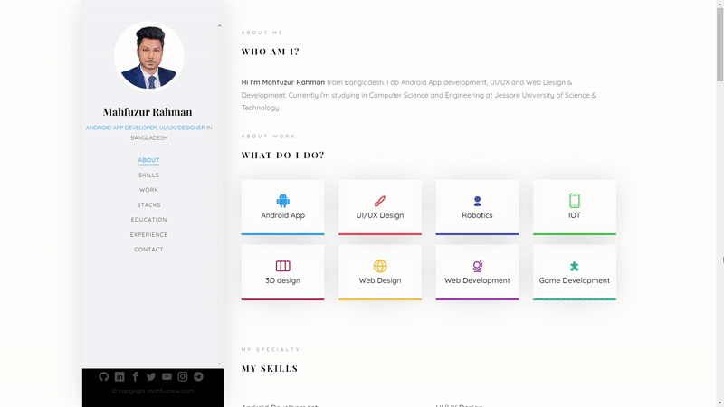

<!---

-->

<!-- 

 -->

# Md. Mahfuzur Rahman

Hi I'm Md. Mahfuzur Rahman from Bangladesh, Working as a Software Engineer at Brain Station 23 Ltd. Also pursuing M.Sc. in Computer Science and Engineering from Bangladesh University of Engineering & Technology (BUET), Dhaka, Bangladesh. I've completed my B.Sc. in Computer Science and Engineering from Jashore University of Science & Technology (JUST), Jashore, Bangladesh.

I specialize in developing native Android applications using Kotlin/Java, XML/Compose, as well as cross-platform applications using Flutter. With a strong understanding of software engineering best practices and Material UI design, I am confident in my ability to produce clean, efficient, and maintainable code. I have a proven track record of collaborating effectively with teams to deliver successful Android and Flutter projects. Other than that I've keen interest in other domains including but not limited to Robotics, IoT, UI/UX Design, 3D design, 3D printing, Web Design & Development, ML/AI and Game Development.

<!---

## Skills
    

   

    

      
 
   
 -->
 
<!--
## Recent Works

 -->

## Portfolio
<a href="https://mahfuznow.com/">
    <picture>
        <source media="(prefers-color-scheme: dark)" srcset="./gif/website_video_dark.gif">
        
    </picture>
</a>

## Contact
  

## Visitor count

  

## GitHub Streak
<picture>
    <source media="(prefers-color-scheme: dark)" srcset="https://github-readme-streak-stats.herokuapp.com?user=mahfuznow&theme=soft-green&hide_border=true">
    
</picture>

## Leetcode stats

<!--
## GitHub Stats
<picture>
<source 
  srcset="https://github-readme-stats.vercel.app/api?username=mahfuznow&show_icons=true&theme=dark"
  media="(prefers-color-scheme: dark)"
/>
<source
  srcset="https://github-readme-stats.vercel.app/api?username=mahfuznow&show_icons=true"
  media="(prefers-color-scheme: light), (prefers-color-scheme: no-preference)"
/>

</picture>

## Top Lang
<picture>
<source 
  srcset="https://github-readme-stats.vercel.app/api/top-langs/?username=mahfuznow&theme=dark"
  media="(prefers-color-scheme: dark)"
/>
<source
  srcset="https://github-readme-stats.vercel.app/api/top-langs/?username=mahfuznow"
  media="(prefers-color-scheme: light), (prefers-color-scheme: no-preference)"
/>

</picture>

-->
